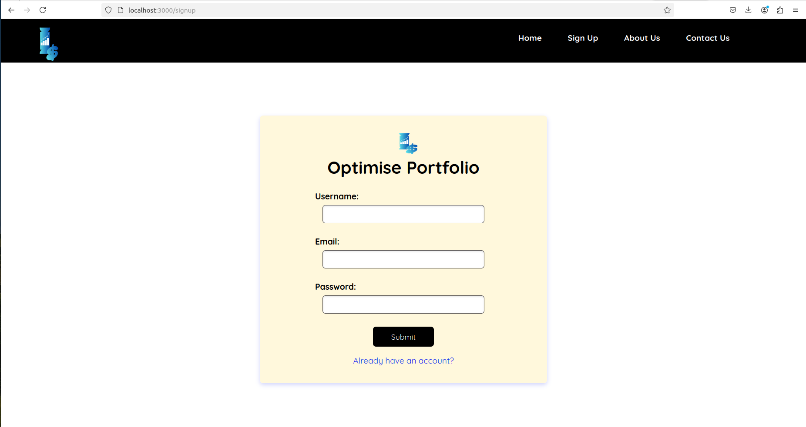
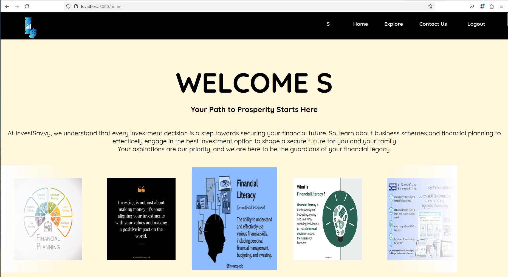
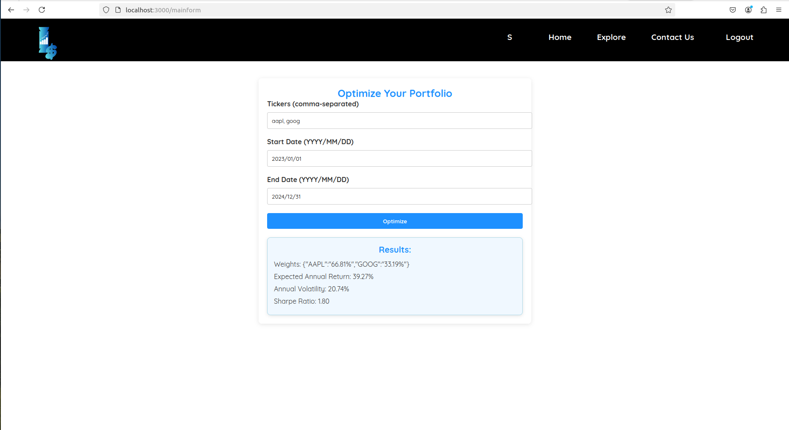
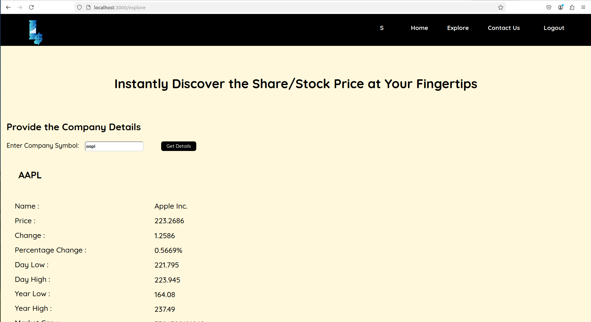
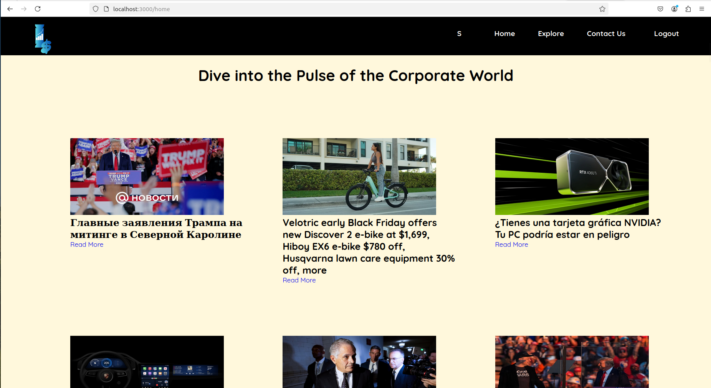

<h1 align="center">
  <br>
  Stock Portfolio Management
</h1>

<div align="center">
   <strong>A platform that values your TIME & MONEY</strong>
</div>
<hr>

<details>
<summary>Table of Contents</summary>

- [Description](#description)
- [Links](#links)
- [Tech Stack](#tech-stack)
- [Progress](#progress)
- [Future Scope](#future-scope)
- [Applications](#applications)
- [Project Setup](#project-setup)
- [Usage](#usage)
- [Contributors](#contributors)
- [Screenshots](#screenshots)

</details>

## 📝Description

This project provides a comprehensive guidance to the user by providing them insights into potential return, Sharpe ratio and Volatility ratio of their preferred stocks within a specified time period. This tool would assist user in making wise decisions by investing into right tickers at right time and build their assests.

#### Key Features: 

<!-- 1. Login/Signup is the key feature that aids in making user's searches and interests private. -->

1. **Portfolio Optimization**: The main aim is to display the Sharpe , Volatility ratio of the input tickers and displaying the weights of the tickers.

2. **Company's Stock Price**: Before thinking to invest, a user can get enlightened about a particular company's stock history of past 5 years, by merely typing the comapny symbol name in the search bar.

3. **Latest News**: For better convenience, our platform also facilitates latest and trending finance, business news, helping users take wise decisions.

4. **Financial Knowledge**: Along with all these, the platform offers a slideshow of images related to investment advice, schemes and financial literacy.

## 🔗Links

- [GitHub Repository](#https://github.com/siddhip2004/StockPortfolioManagement)
- [Drive Link to Screenshots of your project](https://drive.google.com/drive/folders/1srm381439EuOB-fvg3g_aFVpRnPboQf5?usp=sharing)


<!-- Add any more links/resources you used for your project -->

## 🤖Tech-Stack

#### CLient (Front-end)
- 


- CSS

#### Server (Back-end)
- 

- 

- 

- 


#### Database
- 

## 📈Progress

 All the fully implemented features:

- [x] **Stocks to Invest**: Further deciding the term of investment, optimal stocks are displayed.
- [x] **Company's Stock price**:  Typing the symbol name of the company in the search bar and fetching the details.
- [x] **Latest News**: The user is made aware of current affairs to wisely invested in suggested stocks.
- [x] **Financial Knowledge**: Once the user is logged in, the slideshow begins and on hovering, the images enlarges, providing convenience to users.

## 🔮Future Scope

- Increase the accuracy of the output. 

## 💸Applications

>If one wants to invest in stock market, they can get details of that company as well as analyze that stock so that they can invest in a prudent manner.

## 🛠Project Setup

>For Web-App
 1. Clone the GitHub repo:
 <br>

 ```bash
 git clone git@github.com:siddhip2004/StockPortfolioManagement.git
 ```

 2. Enter into client directory, and type the following command to install all the dependencies:

 ```bash
 cd client
 npm i
 npm start
```
 3. To start the backend server:
  ```bash 
 cd server
 npm install
 nodemon server.js   
  ```
 4. To start the ML model:
  ```bash
 cd app
 python3 -m venv .venv. 
 pip install -r requirements.txt
 python3 main.py
  ```

<strong>PS: Use your own API keys for news and fetching details about stocks. <br>The ML model of Yahoo Finance has been used to generate the portfolio.</br></strong>

 ## 💻Usage

> User needs to signup/login (if not a previous user) by providing their credentials, and setup a secure password.With this one can access all features on home page.

* **Portfolio-Optimization**: With the button right below slideshow, 'LET'S BEGIN', one can get generate their stock portfolio.

* **Financial Knowledge**: As soon as the page opens after login/signup, one can view the slideshow to enhance financial knowledge .

* **Comapny's Stock Price**: Moving further, one can enter the symbol of share holding company and get record of its stock of the past 5 years.

* **Latest Financial News**: Last but not least, towards the end, latest financial and business news is displayed to provide user convenience.
## 👨‍💻Contributors

- [Siddhi Parekh](https://github.com/siddhip2004)
- [Raya Chakravarty](https://github.com/Raya679)
 

## 📱Screenshots
- A glimpse of our project 







